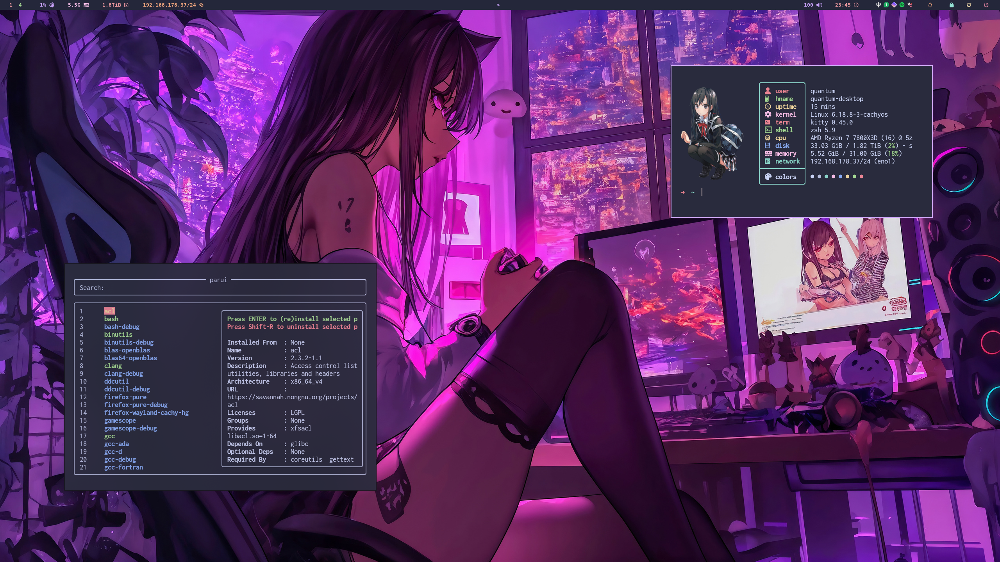

# Hypr

This configuration encompasses the common options between my machines.
The gaps are filled by my [dotfiles](https://github.com/quantumfate/dotfiles) and some private sources.

- Colorscheme: [Catppuccin](https://catppuccin.com/)



## Install

### Ansible (Arch/CachyOS and other non-nix hosts)

Prereqs: `ansible` + an AUR helper (`paru`/`yay`) if you want AUR packages.
From the repo root:

```sh
ansible-galaxy collection install -r ansible/requirements.yml   # once, pulls community.general
ansible-playbook ansible/playbook.yml --ask-become-pass         # stable channel, installs + deploys
```

That installs the official-repo ecosystem, symlinks this repo to
`~/.config/hypr`, deploys the session glue, and enables the `hypr*` user units.

**Extra `-e` options** (append to the `ansible-playbook` line):

- `-e hypr_install_aur_packages=true` — also install the AUR extras
  (`grim-hyprland-git`, `qt6ct-kde`, `greetd-dms-greeter-git`,
  `catppuccin-sddm-theme-*`). Needs an AUR helper; runs unprivileged.
- `-e hypr_channel=git` — ride the rolling **git** channel: the whole hypr\*
  ecosystem from AUR `-git`, built as one coupled group. On a machine that
  already has the stable stack, pair it with the next option.
- `-e hypr_channel_replace_stable=true` — required only for an **in-place**
  stable→git swap: removes the stable coupled packages first (`-Rdd`) so the
  `-git` build has no conflicts. Omit on a fresh host (nothing to replace).
  ⚠️ Rebuilds the compositor from source; if the build fails you're left
  without one until it's fixed — keep your session open. Prefer
  `just channel-git` when you're logged into the target.
- `-e hypr_gpu=other` — strip the NVIDIA env block from `uwsm/env-hyprland`
  (default `nvidia`). Use on Intel/AMD hosts.
- `-e hypr_deploy_session=false` — config only; skip session files + units.
- `-e hypr_install_packages=false` — deploy config only; manage packages
  yourself.

Common combos:

```sh
# Fresh machine, want AUR extras + rolling git compositor:
ansible-playbook ansible/playbook.yml --ask-become-pass \
  -e hypr_install_aur_packages=true -e hypr_channel=git

# Existing stable machine → switch it to git in place:
ansible-playbook ansible/playbook.yml --ask-become-pass \
  -e hypr_channel=git -e hypr_channel_replace_stable=true
```

Keep a git-channel host updated by rebuilding the whole `-git` group together:
`just channel-update` (`paru -Sua`) — never a partial `-Syu`. See the
compatibility model in [ARCHITECTURE.md](./ARCHITECTURE.md).

### Nix (NixOS / nix-managed hosts)

Import `nixosModules.hypr` (system) and `homeManagerModules.hypr`
(home-manager) from this flake, then:

```nix
programs.hyprEnvironment.enable = true;
programs.hyprEnvironment.channel = "git";   # optional: rolling flake set (default "stable")
programs.hyprEnvironment.gpu = "nvidia";    # home module: keep the NVIDIA env block
```

---

## Details

### Delivery model

Dual, full, equal delivery of the whole Hyprland _environment_ (compositor
config + the `hypr*` ecosystem session glue). See [ARCHITECTURE.md](./ARCHITECTURE.md)
and the phased [MIGRATION.md](./MIGRATION.md).

| Path        | Target machines                | Installs + deploys via              |
| ----------- | ------------------------------ | ----------------------------------- |
| **Ansible** | Arch/CachyOS and other non-nix | `ansible/roles/hypr` (pacman + AUR) |
| **Nix**     | NixOS / nix-managed hosts      | `flake.nix` nix modules             |

### Ansible path — knobs

Override role vars with `-e` or a group_vars file:

| Var                           | Default            | Effect                                                                |
| ----------------------------- | ------------------ | --------------------------------------------------------------------- |
| `hypr_install_packages`       | `true`             | Install the ecosystem (channel below). `false` = deploy config only.  |
| `hypr_channel`                | `stable`           | `stable` = official repos; `git` = AUR `-git` coupled group.          |
| `hypr_channel_replace_stable` | `false`            | In-place stable→git swap: `-Rdd`-remove stable first. Opt-in, risky.  |
| `hypr_install_aur_packages`   | `false`            | Install the AUR extras (`hypr_aur_packages`) via a helper.            |
| `hypr_aur_helper`             | `paru`             | AUR helper (`paru`/`yay`) for both the git channel and AUR extras.    |
| `hypr_git_keyserver`          | `keyserver.ubuntu` | HTTPS keyserver for pre-importing `-git` source-signature keys.       |
| `hypr_deploy_session`         | `true`             | Deploy `session/**` + enable user units.                              |
| `hypr_gpu`                    | `nvidia`           | `nvidia` keeps the GPU env block in `uwsm/env-hyprland`; else strips. |
| `hypr_repo_path`              | this repo          | Checkout path when run from a separate controller.                    |

Notes:

- The **git channel** builds from AUR non-interactively: conflicts handled by
  the (opt-in) remove-first step, `--skipreview`, `--removemake`, and an HTTPS
  pre-import of source keys (the local dirmngr/HKP path is often blocked). If a
  new `-git` dep needs a key, add its fingerprint to `hypr_git_gpg_keys`.
- The role symlinks this repo to `~/.config/hypr` (skipped when you already edit
  in place), deploys the session glue ([`session/`](./session/README.md)), and
  enables the `hypr*` user units.

### Nix path

`nixosModules.hypr` enables `programs.hyprland`, the xdg portals, and the
ecosystem packages. `homeManagerModules.hypr` deploys the repo as
`~/.config/hypr`, the uwsm env (NVIDIA block gated by a `gpu` option), and the
custom `hypridle`/`hyprpaper` user units. `nix develop` gives the dev/CI shell.

### CI

Validate-only: `just check-all` (fmt + lua/shell/yaml lint + ansible
syntax/lint) and `nix flake check`. No Galaxy/cachix publishing yet.
